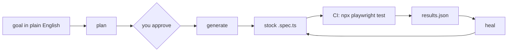

# playwright-wrapper

Describe a test in plain English. Get a normal Playwright spec back.

The model does the slow, boring parts - finding locators on a live page, writing the first draft of a spec, fixing it after the UI moves, pulling data off a page. What you keep is stock Playwright: `npx playwright test`, in your CI, with no model anywhere near the run.

> Runs from source. Not published to npm yet.

## Why not just the Playwright MCP?

The Playwright MCP is good for poking at a page. It is a poor place to keep a test suite, because the model stays in the loop forever - every run is a fresh improvisation that costs tokens and can go a different way.

|  | Playwright MCP | this wrapper |
| --- | --- | --- |
| Who drives the browser at run time | the model, every run | nobody - it is compiled code |
| Cost per run | tokens, every time | zero |
| Same result twice | not guaranteed | yes, it is a file |
| CI needs an API key | yes | no |
| Your agent's context | fills up with page snapshots | untouched - own process, own model |
| What you review | a transcript, after the fact | a plan in plain English, before code exists |

This wrapper uses the Playwright MCP inside, but only while you author. Then it compiles the result and gets out of the way. It reads the accessibility tree as text, not screenshots, so there is no vision model and the default models are small and cheap.



The model works on the left. The right half is Playwright doing what Playwright does.

## What you use it for

Every command but `generate` takes a small spec file: a keyed header, a blank line, then the goal in your own words.

```
profile: test
target: https://app.example.com/login

Sign in with a valid account and land on the dashboard.
```

**1. Write a new E2E test.** The wrapper opens the real page, snapshots it, and proposes one locator per step - locators that exist on that page, not ones a model imagined.

```sh
playwright-wrapper plan login.md > plan.md   # read it, edit what is wrong
playwright-wrapper generate < plan.md        # writes <file>.spec.ts + <file>.plan.md
```

You approve the plan, not 200 lines of code. `generate` refuses on a dirty tree, so generated files never mix with work in progress.

**2. Fix a test the UI broke.** Point it at the failed run. It proposes new locators for the steps that broke and writes a `.heal.md` record of what it tried.

```sh
playwright-wrapper heal playwright-output/<project>/<run-id>/
```

It refuses to patch a run from a different commit than your checkout - a fix against an app that has moved only looks successful.

**3. Pull structured data off a page.** Declare a JSON Schema, get rows back, plus a verdict on whether they can be trusted (schema, page identity, pagination).

```sh
playwright-wrapper browse careers.md > roles.json   # exit 0 pass, 1 not-pass
```

**4. Read a page your agent cannot fetch.** Same `browse` loop: it navigates, clicks and pages through a JS-heavy site until it has the answer. No plan, no code - only a result.

**5. Give a coding agent browser hands without giving it your context.** `playwright-wrapper skill install` drops a Claude Code skill in `~/.claude/skills/`. The session then picks the right verb by itself, calls the bin, and reads the exit code. Page snapshots stay in the wrapper's process.

## Setup

### Let an agent do it

Paste this into Claude Code, or any agent with a shell:

```
Set up https://github.com/thegostev/playwright-wrapper-by-gostev on this machine:
1. Check `node -v` is 20 or newer.
2. Clone it to ~/Developer/playwright-wrapper, then `npm install` and `npm link`.
3. Run `npx playwright install chromium`.
4. Ask me for my Ollama Cloud key. Write `export WRAPPER_OLLAMA_API_KEY=...` into
   ~/.secrets/playwright-wrapper.env, chmod 600 it, and source it from my shell
   profile. Never put the key on a command line.
5. Run `playwright-wrapper skill install`.
6. Verify with `playwright-wrapper --help` and report the exit code.
Do not run `npm i -g playwright-wrapper` - that name belongs to a different package.
```

### Or by hand

```sh
git clone https://github.com/thegostev/playwright-wrapper-by-gostev.git
cd playwright-wrapper-by-gostev
npm install && npm link
npx playwright install chromium

export WRAPPER_OLLAMA_API_KEY=...   # get one at https://ollama.com
playwright-wrapper --help
```

That key is the only variable you must set. Endpoint and model ids have working defaults, and you can point them at any OpenAI-compatible API - see [docs/setup-per-machine.md](docs/setup-per-machine.md) for the full table. Exit codes: `0` ok, `1` config error or not-pass, `2` usage error.

The first browser run on a cold Chromium takes two to three minutes. That is a download, not a hang.

### In the repo that holds the tests

```ts
export default defineConfig({
  testDir: './playwright-output/my-app/specs',   // where generated specs land
  use: { baseURL: process.env.BASE_URL },        // no hardcoded hosts
  captureGitInfo: true,                          // stamps the commit into reports
  reporter: process.env.CI ? [['json', { outputFile: 'results.json' }]] : 'list',
});
```

`baseURL` from the environment is what makes a generated test portable. `captureGitInfo` is what lets `heal` refuse a stale run.

## What it is not

- **Not a replacement for the Playwright runner.** The output is a plain `.spec.ts` with normal assertions. Delete the wrapper tomorrow and your tests still run.
- **Not an MCP server.** It is a CLI. A person or an agent calls it, reads stdout, and acts on the exit code.
- **Not a hosted service.** It calls an LLM API that you configure. Nothing is hosted here.
- **Not autonomous.** The plan gate is a human gate. Nothing is generated that you did not read first.
- **Not a scraper for walled sites.** Logins, captchas and anti-bot walls are out of scope. Public pages are the supported case.
- **Not self-repairing.** A malformed plan or spec is refused with a line number. The wrapper never quietly rewrites broken model output until it parses.

## Development

```sh
npm install
npm test     # node --test
```

`bin/` is the CLI, `src/` is the engine (browser bridge, LLM client, plan grammar, browse loop, drift guard), `spike/` holds the probes that proved each design decision on a real page, `test/` is the suite.

## License

ISC
